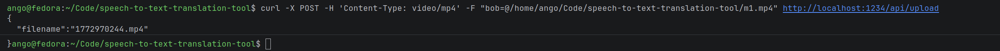
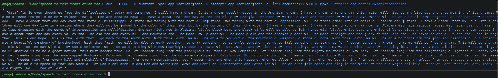
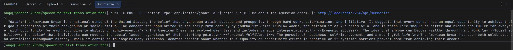

# 🚀 Speech To Text Translation Tool (STT Tool)

This **Speech to Text tool** is used to summarize an uploaded media file into a text file.

We can use this tool to summarize a work meeting or a video lecture into a text file! 

**To use the STT Tool:**
1. **Upload**: User uploads a copy of their media file
2. **Transcribe**: The file is transcribed by the server and returns the
   output as a JSON to the client (in the backend, the media file is
   demultiplexed, and saved as a .wav file and as a .txt file)
3. **Summarize**: the user sends a JSON curl request containing the data to be summarized

This program has **three API** paths which are **upload**, **transcribe**,
and **summarize**.

### Multipart Form Data Parser in C
Additionally, I used a minimal from data parser written by Brian Khuu in C! 😎👌🔥

https://briankhuu.com/blog/2025/01/10/minimal-multipart-form-data-parser-in-c/

## Start the Server
```
gcc server.c -lcurl -ljson-c minimal_multipart_parser.c -o server

# Starting the server at port 1234
./server 1234
```

## Run the UI in index.html


### Examples Client Curl Requests (upload, transcribe, and summarize):
### Upload

Martin Luther King Jr's Sample Link: https://archive.org/details/MLKDream



### Transcribe


### Summarize


**Note:** The extensions is critical for the encoder and must match. Also, there must also be the video, transcribed, and wav-file directories created.
___
### Steps that happen behind each API call
1. Upload
   2. demux_decode
   3. ffplay
2. Transcribe
   1. ffmpeg 
   2. Whisper.cpp
3. Summarize
___

## FFmpeg
First install FFmpeg and then run the following commands:

**Command -- We can check that the file upload worked**
```
ffplay -f f32le -ar 44100 transcribed/171234

# my version
ffplay -f f32le -ar 44100 transcribed/1766321407(witout an extension)
```
**Command -- convert the file into a format Whisper can user**
```
ffmpeg -f f32le -ar 16000 -ac 2 -i transcribed/171234 transcribed/17123.wav
```

## Confirm that the file upload worked
```
ffplay -f f32le -ar 44100 transcribed/171234

# my version
ffplay -f f32le -ar 44100 transcribed/1766321407(witout an extension)
```
**Command -- convert the file into a format Whisper can convert**
```
ffmpeg -f f32le -ar 16000 -ac 2 -i 171234 171234-output.wav 
```


# 📝 Build and Run Whisper.cpp for Transcription

Let's build Whisper.cpp to summarize the transcription! 😀💯

1. Go to the whisper.cpp Github repository:
```
https://github.com/ggml-org/whisper.cpp
```
2. Navigate into the directory one level higher than your project
3. First clone the Whisper.cpp repository:
```
git clone https://github.com/ggml-org/whisper.cpp.git
```
4. Navigate into the directory:
```
cd whisper.cpp
```
5. Then, download one of the Whisper models converted in ggml format. For example:
```
sh ./models/download-ggml-model.sh base.en
```
Since I'm using the medium model, I'll type:
```
sh ./models/download-ggml-model.sh medium.en
```
Now build the whisper-cli example and transcribe an audio file like this:
```
# build the project
cmake -B build
cmake --build build -j --config Release
```
For Fedora users, we would have to use:
```
sudo dnf install cmake
```

### Command -- Transcribe the audio file to text
```
./build/bin/whisper-cli -f samples/jfk.wav

# Here is an example where the Whisper directory is outside of the project
./build/bin/whisper-cli -m /home/ango/Code/whisper.cpp/models/ggml-medium.en.bin -f /home/jane_doe/Code/speech-to-text-translation-tool/wav-files/1774225281.wav > /home/jane_doe/Code/speech-to-text-translation-tool/transcribed/1774225281-out1.txt
```
___


## Upload <a name="upload"></a>
The client uploads a media file using the POST request. If the request
is successful, the server sends back an HTTP 200 response to the client
with the filename.


**HTTP Method: POST**
```
URL: http://localhost:8001/api/upload
Required Header: Accept: video/mp4
```
Command -- to compile the demux decode portion from the beginning: 
```
gcc demux_decode.c -I /usr/include/ffmpeg -lavcodec -lavutil -lavformat -o demux_decode 
./demux_decode video/171234.mp4 transcribed/171234(without an extension)
```

**Command -- The client sends the following upload curl request to the server**
This would be the path of the .mp4 file and then calling the server at the specified port number
```
curl -X POST -H 'Content-Type: video/mp4' -F "bob=@/home/ango/Code/speech-to-text-translation-tool/Dream.mp4" http://<ip_address_of_server>:1234/api/upload
```

**Response from Server back to the client -- UNIX time as a filename sent back to the client**
```
{"filename" : "171234.mp4"}
```

## Transcribe the Uploaded Media File <a name="transcribe"></a>

To transcribe a file, the client will send a filename as a curl request to the server.
The server parses out the filename, and sends the transcribed
file back to the client.

**Command - Client sends a curl request of a .mp4 file to the server**
```
curl -X POST -H "Content-Type: application/json" -H "Accept: application/json" -d '{"filename":"1766321407.mp4"}' http://<IP_ADDRESS_OF_SERVER>:1234/api/transcribe
```
And the server will respond back to the client with a JSON like so:


### Transcribe using Discrete GPU
First, since I am using two discrete Intel GPUs, I am using the first flag of "GGML_VK_VISIBLE_DEVICES". I ran an experiment. With the use of integrated GPUs, it takes 1/3 of the time to get the results back going from 120 seconds to 45 seconds.

```
GGML_VK_VISIBLE_DEVICES=1 ./build/bin/whisper-cli -m /home/ango/Code/speech-to-text-translation-tool/whisper.cpp/models/ggml-medium.en.bin -f /home/ango/Code/speech-to-text-translation-tool/video/1770524671.mp4 -t 24 > /home/ango/Code/speech-to-text-translation-tool/translation-output2.txt
```
## Benchmarks
Time difference between using Vulkan and non Vulkan
- transcription without the Vulkan build: 103290.34ms
- transcription with the Vulkan build: 45444.62ms

## Official Commands to Run
This is what happens behind the scenes to output the transcription
```
ffplay -f f32le -ar 44100 transcribed/171234
ffmpeg -f f32le -ar 16000 -ac 2 -i transcribed/171234 transcribed/171234.wav
# Be in the same directory as Whisper.cpp
./whisper.cpp/build/bin/whisper-cli -m /home/ango/Code/speech-to-text-translation-tool/whisper.cpp/models/ggml-medium.en.bin -f /home/ango/Code/speech-to-text-translation-tool/transcribed/1768538365.wav -t 24 > /home/ango/Code/speech-to-text-translation-tool/translation-output1.txt
```
Below is the structure of the string used in summarization when the client sends the 
data over to the server.
```
{
           "model": "qwen3-30b-a3b-instruct-2507",
           "messages": [
             {
               "role": "user",
               "content": "hi"
             }
           ]
         }
```
**How would I upload a media file?**

The client first uploads a media file using a POST request, and gets back a
HTTP 200 response with the filename if the request is successful.

___
## 📌 Summarize <a name="summarize"></a>
To summarize, the curl request is sent as a JSON object
  with the data as a key and the transcribed data as the value. The server will take this request
and pass it to a LLM to be summarized, and sent back to the client.
```
curl -X POST -H "Content-Type: application/json" -d '{"data" : "
[00:00:00.000 --> 00:00:16.160]   So even though we face the difficulties of today and tomorrow, I still have a dream.
[00:00:16.160 --> 00:00:25.480]   It is a dream deeply rooted in the American dream.
"}' http://localhost:1234/api/summarize
```
#### Command - Curl request sent from the client to the server
```
curl -X POST -H "Content-Type: application/json" -d '{"data" : "Write me a three letter word."}' http://<IP_ADDRESS_OF_LM_MODEL>:1234/api/summarize
```

___
## Data <a name="data"></a>

This is how the data should look like on the server side:
```
# JSON for LM Studio: 

- root
- modecurl -X POST -H "Content-Type: application/json" -d '{"data":"\n So even though we face the difficulties of today and tomorrow, I still have a dream. It is a dream deeply rooted in the American dream. I have a dream that one day this nation will rise up and live out the true meaning of its dreams. We hold these truths to be self-evident that all men are created equal. I have a dream that one day on the red hills of Georgia, the sons of former slaves and the sons of former slave owners will be able to sit down together at the table of brotherhood. I have a dream that one day even the state of Mississippi, a state sweltering with the heat of injustice, sweltering with the heat of oppression, will be transformed into an oasis of freedom and justice. I have a dream. that my four little children will one day live in a nation where they will not be judged by the color of their skin but by the content of their character. I have a dream today. I have a dream that one day down in Alabama with its vicious races, with its governor having his lips dripping with the words of interposition and nullification. One day right now in Alabama, little black boys and black girls will be able to join hands with little white boys and white girls as sisters and brothers. I have a dream today. I have a dream that one day every valley shall be exalted and every hill and mountain shall be made low. places will be made plain and the crooked places will be made straight and the glory of the lord shall be revealed and all flesh shall see it together. This is our hope. This is the faith that I go back to the south with. With this faith, we will be able to you out of the mountain of despair, a stone of hope. with this faith, we will be able to transform the jangling discords of our nation into a beautiful symphony of brotherhood. With this faith, we will be able to work together, to pray together, to struggle together, to go to jail together, to stand up for freedom together, knowing that we will be free one day. This will be the day. This will be the day with all of God's children. We'll be able to sing with new meaning my country tears will be. Sweet land of liberty of thee I sing. Land where my fathers died, land of the pilgrims. From every mountainside, let freedom ring. And if America is to be a great nation, this must become true. So let freedom ring from the prodigious hilltops of New Hampshire. Let freedom ring from the mighty mountains of New York. Let freedom ring from the heightening alligators of Pennsylvania. Let freedom ring from the snow-capped Rockies of Colorado. Let freedom ring from the curvaceous slopes of California. But not only that, let freedom ring from Stone Mountain of Georgia. Let freedom ring from Lookout Mountain of Georgia. Tennessee. Let freedom ring from every hill and molehill of Mississippi, from every mountainside. Let freedom ring and when this happens, when we allow freedom ring, when we let it ring from every village and every hamlet, from every state and every city, we will be able to speed up that day when all of God's children, black men and white men, Jews and Gentiles, Protestants and Catholics will be able to join hands and sing in the words of the old Negro spiritual, free at last, free at last. Third, forward."}' http://localhost:1234/api/summarizel
  - message
    - role
    - content
```

**Curl Request Format that LM Studio Requires:**
```
curl -X POST "<API_BASE_URL>/v1/chat/completions" \
     -H "Content-Type: application/json" \
     -d '{
           "model": "qwen3-30b-a3b-instruct-2507",
           "messages": [
             {
               "role": "user",
               "content": "hi"
             }
           ]
         }'
```
```
curl -X POST "127.0.0.1:8000/v1/chat/completions" -H "Content-Type: application/json" -d '{ "model": "qwen-30b-a3b-instruct-2507", "messages": [ { "role": "user", "content": "today and tomorrow, I still have a dream." } ] }'
```

**Required Request Format**

|Field   | Type    | Description                                                               
|--------|---------|--------------------------------------------------------------------------------------------|
| upload | String  | Filename of the UNIX time {"filename" : "171234.mp4"}                                      |
| transcription | String  | Transcribed data from the media filename {"data" : "I have a dream"}                       |
| summarize | String  | Summarized text from the transcription file {"summary" : "In this powerful moving speech"} |
_________________________________________________________________________
# 🚀 Testing

### Test Machine<a name="testing"></a>
| Field | Type   | Description              |
|   ---- |--------|--------------------------|
|CPU| 13th Gen Intel(R) Core(TM) | i7-1360P (16) @ 5.00 GHz |
|System Memory| RAM    | 64 GB                    |
|Host OS| Fedora 43 | Linux kernel 6.17.12-300.fc43.x86_64 |
_________________________________________________________________________


- Summarize function

- To compile the demux decode portion from the beginning:
  gcc demux_decode.c -I /usr/include/ffmpeg -lavcodec -lavutil -lavformat -o
  demux_decode
  `./demux_decode video/171234.mp4 transcribed/171234(without an extension)`
```
//ffmpeg -f f32le 16000 -ac 2 -i video/171234.mp4 transcribed/171234
ffmpeg -f f32le -ar 16000 -ac 2 -i 171234 171234-output.wav 
ffmpeg -f f32le -ar 16000 -ac 2 -i transcribed/z-audio(original copy) 
transcribed/z-output.wav-output-wav-for-whisper/z-audio-output.wav << might 
REALLY NEED TO HAVE EXTENSION
```

### 🛠️ Tools:
Command to make a clip from a sound file
Here is an example:
```
# Trim an audio file
ffmpeg -i file.mkv -ss 20 -to 40 -c copy file-2.mkv
ffmpeg -i file.mkv -ss 00:00:20 -to 00:00:40 -c copy file-2.mkv
```
